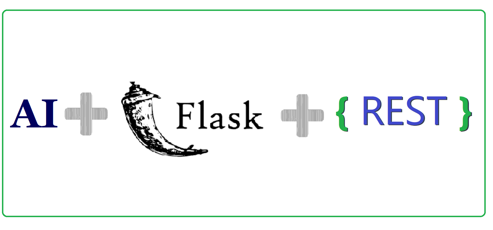

SMILES representation of compounds to recognize chemical motif With CNN and MLP deep learning appoarches 
------------



<center>Fig: A snapshot of workflow using the CNN-MLP-Motif (AI) in production</center>

## Objective

The objective of this work is to understand the application of Convolutional Neural Network model for representation of compounds to detect chemical motif (also known as structural motif). This work examins CNN [1,2] and Multi layer perceptron with four hidden layers [3] to recognize motifs, fingerprint(s) in a given unstructured text into pre-defined binary categories such as 0, 1. 


    __status__          = "Dev"
    __version__         = "1.0"
    __clientname__      =  "{TBD, Data Science Dept. }"
    __copyright__       = "Copyright 2020"

Contributors
--------------
    __project_manager __   = "TBD "
    __maintainer      __   = "Mehdi Habibzadeh;  Nimahm@gmail.com"

      

Releases
--------------
| status | ver | date | categories |
| :--------| :--------| :-------- | :-------- |
| Prod | 1.0 | 12 Aug 2020 | Motif Structures, Binary classification, CNN ; MLP |
| PoC | 1.0 | 10 Aug 2020 | Motif Structures, Binary classification |


Project Layout
--------------

--------------
Project root in folder (SMILES): 

*/fingerprintSMILES*


```
    {project root}/
          |
          +-- LICENSE.txt          
          +-- README.md            
          +-- environment.yml     : List of Mini-conda packages ,dependencies and also Python libs 
          |                          $ conda & pip list > environment.txt     - to export and
          |                          $ conda env create -f environment.yml - to install
          +-- deploy /log
          |    |
          |    +-- access.log      : log file (Not used)
          |    +-- error.log       : log file (Not used)
          |    
          +-- projectConcept
          |    |
          |    +-- description.pdf             : Problems and Requirements. 
          |    
          +-- trainedModels
          |    |
          |    +-- cnn_model.h5     : Keras CNN model in H5 format; Load Weights.
               +-- cnn_model.json   : Keras CNN model in JSON format; Load Model structure
               +-- mlp_model.h5     : Keras MLP model in H5 format; Load Weights.
               +-- mlp_model.json   : Keras MLP model in JSON format; Load Model structure
           
          +-- trainingData
          |    |
          |    +-- dataset_single.csv : P1 (Binary Classes), mol_id (unique ID), SMILES (motif).
               +-- dataset_multi.csv  : P(Multi-Label Classes), mol_id (unique ID), SMILES (motif)
               +-- mlp_model.h5     : Keras MLP model in H5 format; Load Weights.
               +-- mlp_model.json   : Keras MLP model in JSON format; Load Model structure     
          |    
          +-- Dockerfile : Shell and Python scripts to assemble an Docker image (Run Conda Enviroment and Gunicorn to handle Multiple Concurrent requests)
          |                          
          +-- myproject.py  : Main function to call trained models; either with CNN or MLP to create Flask microservice ; to create Result Dictionary.
          +-- wsgi.py    : Entrypoint to be called with WSGI HTTP server to run Flask in production
          |                         
          |                         
          +-- cnnTrain.py : Train with CNN , Conv1D, loss='binary_crossentropy', optimizer='adam', activation='relu',
          +-- cnnPredict.py : Probability >0.5  (0, 1)
          +-- utils.py   : This includes three pre-processing functions; Extract features with RDKit, Reshape for ConvD1 and Data spliting to training and evaluation steps.  
          +-- mlpTrain.py   : Train with MLP concept, nBits=256, loss='binary_crossentropy', optimizer='adam',  activation='relu' and "sigmoid"  
          +-- mlpPredict.py : Probability >0.5  (0, 1)
          +-- mlp_utils.py   : This includes two pre-processing functions; Extract features with RDKit, and Data spliting to training and evaluation steps
          
--------------
```

Getting Started
--------------
Guide potential devolers / users through getting code up-and-running on their own system. In the following sub-sections, you could walk though sub-sections:

1.  Introduction
3.  How to config
2.  How to call API 
4.  Tools/Dependencies
5.  Test Discovery
6.  Future work
7.  References


Introduction & Discussion
--------------

This work addressed screening lead compounds for drugs. Deep learning models by addressing the motif fingerprints and graph convolution architectures are reliable solution. Deep learning(s) distinguish structural differences to discover effective features. This work traces features learned by SMILES-based representation to adequately express a rich feature space to lead the accurate discrimination of compounds. To prove this principle, we applied CNN and MLP with multi hidden layers. To test the approach, this work classified two P types (0,1) using 4999 training **imbalanced** samples. This work demonstrated class weighting technique [4] to deal imbalanced dataset in which the number of examples in class one outnumbers the sample in another with roughly 80/20. Current framework accurately detected on average F1 score 72% of using the CNN settings trained model. Then, MLP with four hidden layers outperforms than former with 88%. Also , this conclusion was supported by accuracy 80% and 61% for MLP and CNN respectively. 


How to config
--------------
The process for developing a machine learning model is divided into two principal steps; **Training** and then **Prediction Service** with User Flask Interface (Production Version).

## Training Code:

The CNN, MLP training (*Learning from scratch*) steps and details are addressed in [1,3]. Readers need to review carefully all details. As a brief, functions and steps in action are clearly listed in-line code (See cnnTrain.py and mlpTrain.py). 

run below code selectively to start *training* procedures with *dataset_single.csv* and *epoch=50* .
    
*For CNN* 
    
```bash
$ nohup python cnntrain.py  > 50log.2020-12-aug-cnnTrain.out &   

```
*For MLP - 4 hidden layers*

```bash
$ nohup python mlpTrain.py > 50log.2020-12-aug-mlptrain.out &  

```

## Production Service code:

The production version is composed of two trained model components in Keras H5 and JSON format while client code is triggered upon per event with Flask URL request. 

### trained code: 

All trained models with production codes are saved in below local address :
```bash
/trainedModels
```
Note : *All required configuration and model names, settings are addressed in training files, namely are cnnTrain.py and mlpTrain.py* 

### Client code: 

is a client (consumer) Docker equipped with Python Flask microservice app that comunicates with saved models. More information for writing Dockerfiles are in [5,6].

* Docker Images : servier
 

All source code to create a modified client docker image [if necessary! do with caution] are in : 

```bash
$ /fingerprintSMILES  {root directory}

```
That composes of files that listed as:
 
1- myproject.py (main file to call prediction functions from cnnPredict and mlpPredict) 
<br>
2- DockerFile (should be modified with caution)
<br>
3- environment.yml (Required Libraries; scikit-learn [7] , rdkit  [8],  request, tensorflow-cpu==2.3.0, keras, Flask, Gunicorn, Werkzeug [9, 10, 11])


_ **To Stop/ Delete running docker container to re-create a modified docker image [if necessary! do with caution]**:

  
1- *Stop / Delete* : 
```bash
docker rm $(docker stop $(docker ps -a -q --filter ancestor=servier --format="{{.ID}}")); docker images -a | grep "servier" | awk '{print $3}' | xargs docker rmi -f
```
_ **To create a docker image and run a container on port [if necessary! do with caution]**: 

2- *Build Image / Create Container* :

```bash
docker build . -t servier

docker run -p 5000:5000 servier
```

### Auto Scaling  (Gunicorn):

In this work, we are making *Auto Scaling* even more powerful with the addition of predictive scaling. What we know about auto-scaling is largely based upon empirical studies and experimental online load. These settings must be interpreted with caution and economic-wise. However, this finding, while preliminary, suggests a pipline that works for multiple concurrent requests. This finding has important implications for in house auto-scaling developing and further studies are required to establish this. This piplelines includes combination of WSGI Entry Point [9,11], 

- *WSGI Entry Point*:  WSGI HTTP Server to run Flask in production and at scale. Serving Flask end-point with Gunicorn is applied. 


How to call API / End point 
--------------
Data POST request with JSON format to predefined path and route url = 'http://localhost:5000/predict'. More details are in below file : 
```bash
/request_example.py
```
---------------------------
```python

#!/usr/bin/env python3
# -*- coding: utf-8 -*-

import json
import requests

url = 'http://localhost:5000/predict'


data = {"text": "CC1(C)CC(=O)N(CC(=O)NC2CCCC2)c2ccccc2S1(=O)=O"}


response = requests.post(url, json=data)

print(response.content)

>>> b'{"isBase64Encoded": false, "statusCode": "200", "headers": {"Content-Type": "text/plain"}, "body": {"cnnPredict": [1], "mlpPredict": [1]}}'

```

Note : To run different Host :  change url adrs, change host IP in myproject.py  (if needed)


Tools/Dependencies
--------------
- Packages: Tensorflow CPU v2.3.0, Keras v2.4.3, Flask, ... (see environment.yml)
 

Test Discovery
--------------

First define PATH variable(s) in system PYTHONPATH. 

Step A) 
```bash
export PATH=$PATH:<User Current Adrs>/fingerprintSMILES" 

```

Step B) Run selectively, upon each request (at project directory level) , 

Run below code selectively to generate **AUC , Accuracy, and F-Score** measures for *test data-set* while training for arbitary epoch( 50 is recommended).
    
*For CNN* 
    
```bash

$ python cnnTrain.py

```
*For MLP-4 layers*

```bash
$ python mlpTrain.py

```

==========================

Future work
--------------

* Autoscaling Modification and settings to reach optimum concurrent settings.
* Multi-label classification should be considered  (Model03 with trainingData/dataset-multi.csv).
* A further study with more focus on deep learning and its variations is therefore suggested. 
* Code modification to accept bach data .
 
References
----------

  * [1] [CNN based on SMILES](https://bmcbioinformatics.biomedcentral.com/track/pdf/10.1186/s12859-018-2523-5)
  * [2] [Keras in CNN](https://keras.io/api/layers/convolution_layers/convolution1d/)
  * [3] [MLP for molecules](https://towardsdatascience.com/lets-make-some-molecules-with-machine-learning-%EF%B8%8F-429b8838e3ef)
  * [4] [Classification on imbalanced data](https://www.tensorflow.org/tutorials/structured_data/imbalanced_data)
  * [5] [Activating Conda in Dockerfile](https://pythonspeed.com/articles/activate-conda-dockerfile/)
  * [6] [Writing a Dockerfile](https://docs.docker.com/develop/develop-images/dockerfile_best-practices/)
  * [7] [Scikit Learn in ML](https://scikit-learn.org/stable/)
  * [8] [RDKit: Open-Source Cheminformatics Software](https://www.rdkit.org/)
  * [9] [WSGI web application library](https://pypi.org/project/Werkzeug/)
  * [10] [Flask - Web Application Framework](https://www.palletsprojects.com/p/flask/)
  * [11] [Gunicorn - Python WSGI HTTP Server](https://gunicorn.org/)
 
 
 <br>
 <br>
 -------------------------
 
 
 (c) 2020, [TBD Laboratories](https://TBD. /) License.
